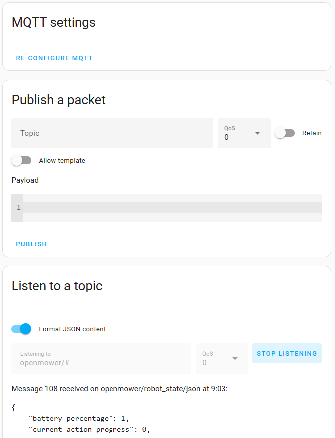
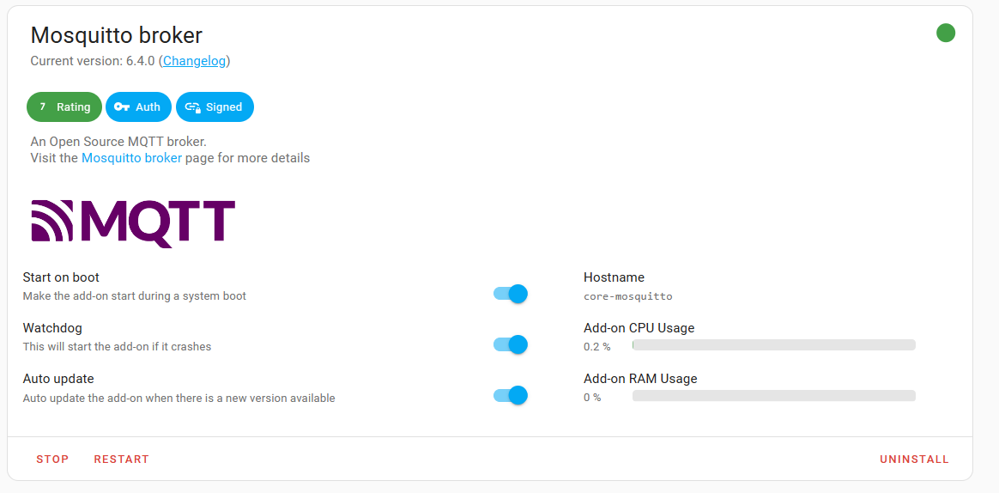
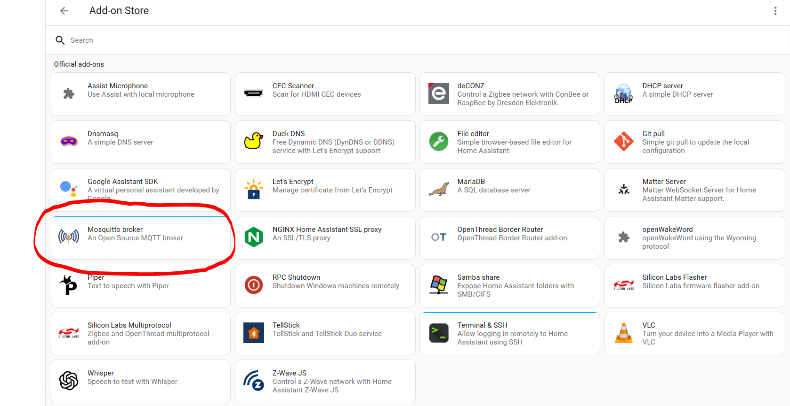

OpenMower integration for HomeAssistant
===

Openmower is the DIY RTK GPS Smart Mowing Robot for Everyone! Based on the YardForce classic 500 lawn mover and fully open source. A custom built motherboard, a raspberry pi and a GPS module gets rid of the guide wire and makes software the key factor in the project.

[openmower.de](https://openmower.de/)

[Openmower on github](https://github.com/ClemensElflein/OpenMower)

This integration is based on MQTT messages from the openmower container that runs on the RPI. 

It will give you full control over the mower. Buttons to start, stop, pause, create automations from etc. Statistics like battery load, motor temperature, location. GPS coordinates are integrated into the device tracker.


Prerequisites
===
* A functional openmower (doh!)
* A software version where MQTT is supported, currently only on the edge version.
* Activated MQTT in openmower config (/boot/openmower/mover_config.txt)
```
export OM_MQTT_ENABLE="True"            # Enable or disable
export OM_MQTT_HOSTNAME="10.2.3.4"      # IP or hostname of your HA
export OM_MQTT_PORT="1883"              # Port, default 1883
export OM_MQTT_USER="mqtt_om"           # MQTT user on your HA
export OM_MQTT_PASSWORD="mqtt_om"       # MQTT password on your HA
export OM_MQTT_TOPIC_PREFIX="openmower" # The prefix that all MQTT traffic from this mower should have. If you have multiple mowers this can be used to separate them.
```
* Home assistant with HACS
* Mosquitto or similar MQTT broker. Mosquitto is the easiest to install, you find it in the add-on store. 




Once installed it will turn up in the normal integrations as MQTT.


Installation
===

Install via HACS by adding https://github.com/vermut/ha_openmower.git as a Custom Repository. Refresh HACS, go to Openmower and download the integration.

Add the integration in settings -> integrations. Here you fill in the details for your mower. I.e. the prefix and the LAT/LONG from the openmower config file.


Your mower should now turn up in Home assistant




Troubleshooting
===
Verify that mqtt is active on the openmower and check if xbot_monitoring is connected to homeassistant.
```
openmower@openmower:~ $ sudo netstat -pnt | grep 1883 | grep xbot_monitoring
tcp        0      0 127.0.0.1:42818         127.0.0.1:1883          ESTABLISHED 911/xbot_monitoring
tcp        0      0 <MOWER_IP>:43340     <HOMEASSISTANT_IP>:1883      ESTABLISHED 911/xbot_monitoring
```
Verify that messages actually reach HA. In the MQTT integration listen for topic # or e.g. openmower/# if your prefix is openmower.


Additional resources
===

[RPI MQTT monitor](https://github.com/2m/rpi-mqtt-monitor-docker)
Nice way to get stats from the RPI into your HA. Install as a service/container on the RPI. In Mosquitto you add a bridge config for the messages.



Place the config file in /share/mosquitto in your HA, remember to do it IN the HA container if you run like that.
